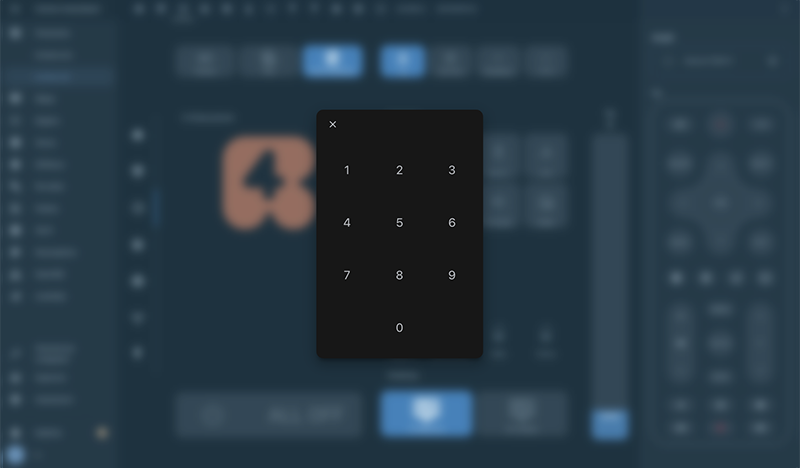

# Channel Pad for LG WebOs TV




## hacs Card install
1. add custom reposity: madmicio/channel-pad as plugin.

2. install `LG Keypad` plugin

3. Add a reference  inside your resources config:

  ```yaml
resources:
- type: module
    url: /hacsfiles/LG-Keypad/card-numeric-pad.js
```


### Manual install

1. Download and copy `card-numeric-pad.js` from (https://github.com/madmicio/LG-Keypad) into your custom components  directory.

2. Add a reference `card-numeric-pad.js` inside your resources config:

 ```yaml
  resources:
    - url: /local/"your_directory"/card-numeric-pad.js
      type: module
```

### Use as standalone card:
lovelace config:

 ```yaml
type: 'custom:card-numeric-pad'
entity: media_player.tv_lg_55c8
```


